# Score Correction Impact Report

## Overview

This report shows how applying the SSB score corrections affects student competence level classifications.
Each table shows the transition from original levels (rows) to corrected levels (columns).

**Analysis period:** 2014-2021
**Total observations:** 2,821,431

### Impact Summary

The figure below shows the share of pupils whose competence level assignment changed after correction,
by subject and grade level over time.

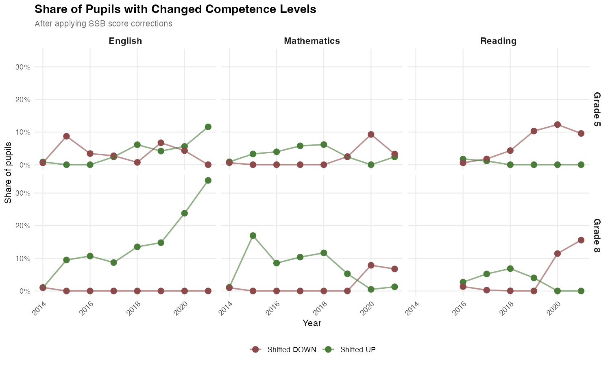

# English (Engelsk)

## Grade 5 (5. trinn)

### Score Ranges with Level Changes

The figure below shows which score ranges resulted in different competence level assignments after correction.
Green segments indicate scores that were upgraded; red segments indicate downgrades.

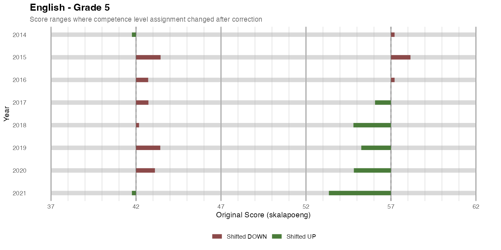

---

### 2014

| Original | Level 1 | Level 2 | Level 3 | Total |
|---:|---:|---:|---:|---:|
| Level 1 | 12,557 |    478 |      0 | 13,035 |
| Level 2 |      0 | 30,220 |      0 | 30,220 |
| Level 3 |      0 |    327 | 13,176 | 13,503 |

**Total test-takers:** 56,758
- **Shifted level:** 805 (1.42%)
- **Shifted up:** 478 (0.84%)
- **Shifted down:** 327 (0.58%)

### 2015

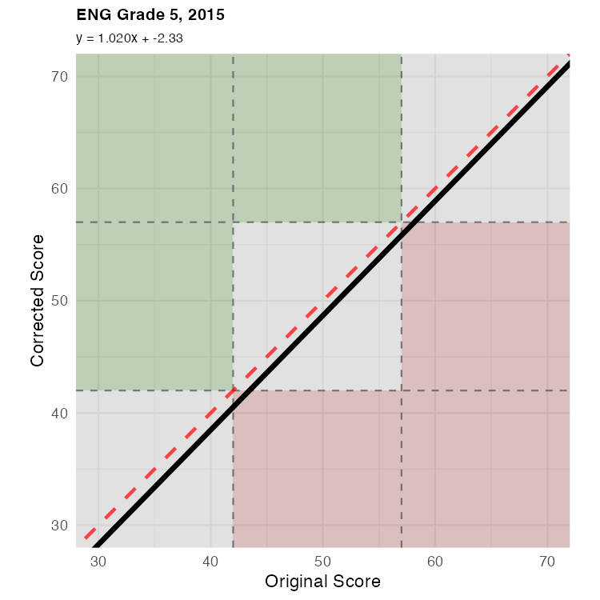

| Original | Level 1 | Level 2 | Level 3 | Total |
|---:|---:|---:|---:|---:|
| Level 1 | 13,316 |      0 |      0 | 13,316 |
| Level 2 |  3,491 | 26,829 |      0 | 30,320 |
| Level 3 |      0 |  1,449 | 11,547 | 12,996 |

**Total test-takers:** 56,632
- **Shifted level:** 4,940 (8.72%)
- **Shifted up:** 0 (0%)
- **Shifted down:** 4,940 (8.72%)

### 2016

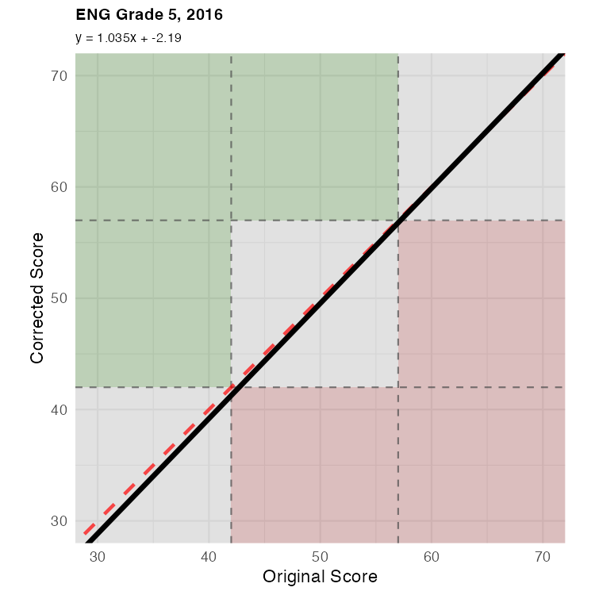

| Original | Level 1 | Level 2 | Level 3 | Total |
|---:|---:|---:|---:|---:|
| Level 1 | 13,038 |      0 |      0 | 13,038 |
| Level 2 |  1,711 | 30,050 |      0 | 31,761 |
| Level 3 |      0 |    273 | 13,164 | 13,437 |

**Total test-takers:** 58,236
- **Shifted level:** 1,984 (3.41%)
- **Shifted up:** 0 (0%)
- **Shifted down:** 1,984 (3.41%)

### 2017

| Original | Level 1 | Level 2 | Level 3 | Total |
|---:|---:|---:|---:|---:|
| Level 1 | 12,363 |      0 |      0 | 12,363 |
| Level 2 |  1,591 | 28,651 |  1,389 | 31,631 |
| Level 3 |      0 |      0 | 14,087 | 14,087 |

**Total test-takers:** 58,081
- **Shifted level:** 2,980 (5.13%)
- **Shifted up:** 1,389 (2.39%)
- **Shifted down:** 1,591 (2.74%)

### 2018

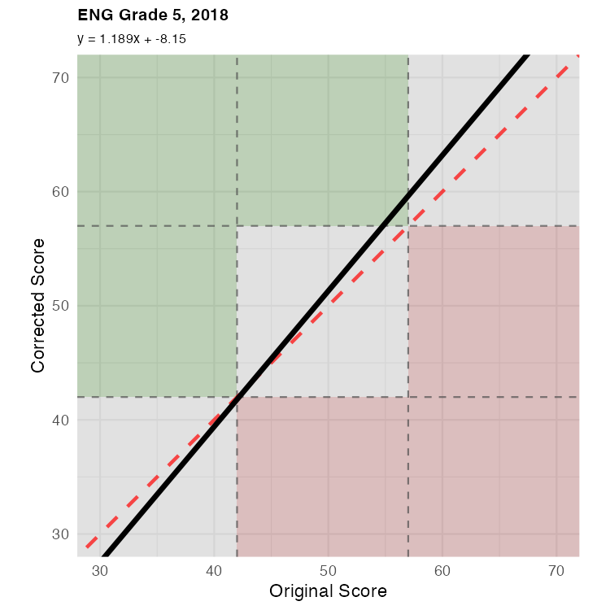

| Original | Level 1 | Level 2 | Level 3 | Total |
|---:|---:|---:|---:|---:|
| Level 1 | 12,764 |      0 |      0 | 12,764 |
| Level 2 |    429 | 27,990 |  3,662 | 32,081 |
| Level 3 |      0 |      0 | 14,958 | 14,958 |

**Total test-takers:** 59,803
- **Shifted level:** 4,091 (6.84%)
- **Shifted up:** 3,662 (6.12%)
- **Shifted down:** 429 (0.72%)

### 2019

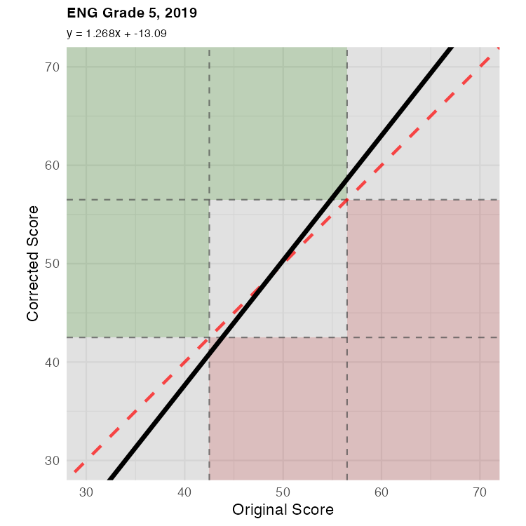

| Original | Level 1 | Level 2 | Level 3 | Total |
|---:|---:|---:|---:|---:|
| Level 1 | 13,600 |      0 |      0 | 13,600 |
| Level 2 |  4,073 | 25,348 |  2,539 | 31,960 |
| Level 3 |      0 |      0 | 15,166 | 15,166 |

**Total test-takers:** 60,726
- **Shifted level:** 6,612 (10.89%)
- **Shifted up:** 2,539 (4.18%)
- **Shifted down:** 4,073 (6.71%)

### 2020

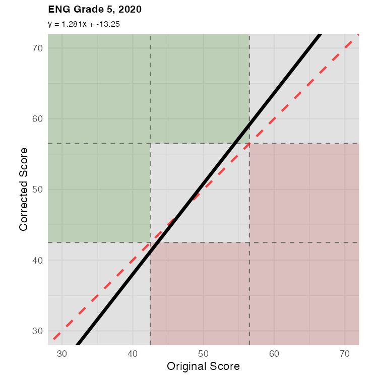

| Original | Level 1 | Level 2 | Level 3 | Total |
|---:|---:|---:|---:|---:|
| Level 1 | 13,679 |      0 |      0 | 13,679 |
| Level 2 |  2,583 | 24,614 |  3,357 | 30,554 |
| Level 3 |      0 |      0 | 15,769 | 15,769 |

**Total test-takers:** 60,002
- **Shifted level:** 5,940 (9.9%)
- **Shifted up:** 3,357 (5.59%)
- **Shifted down:** 2,583 (4.3%)

### 2021

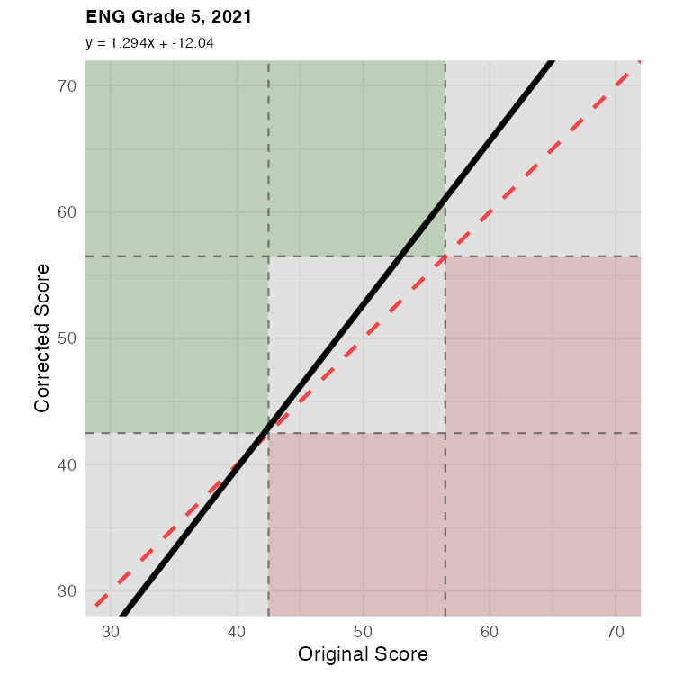

| Original | Level 1 | Level 2 | Level 3 | Total |
|---:|---:|---:|---:|---:|
| Level 1 | 12,940 |    527 |      0 | 13,467 |
| Level 2 |      0 | 22,033 |  6,230 | 28,263 |
| Level 3 |      0 |      0 | 16,515 | 16,515 |

**Total test-takers:** 58,245
- **Shifted level:** 6,757 (11.6%)
- **Shifted up:** 6,757 (11.6%)
- **Shifted down:** 0 (0%)

## Grade 8 (8. trinn)

### Score Ranges with Level Changes

The figure below shows which score ranges resulted in different competence level assignments after correction.
Green segments indicate scores that were upgraded; red segments indicate downgrades.

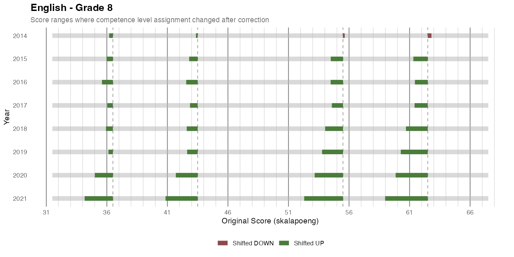

---

### 2014

| Original | Level 1 | Level 2 | Level 3 | Level 4 | Level 5 | Total |
|---:|---:|---:|---:|---:|---:|---:|
| Level 1 | 5,516 |   325 |     0 |     0 |     0 | 5,841 |
| Level 2 |      0 | 11,112 |    234 |      0 |      0 | 11,346 |
| Level 3 |      0 |      0 | 21,197 |      0 |      0 | 21,197 |
| Level 4 |      0 |      0 |    242 | 11,435 |      0 | 11,677 |
| Level 5 |     0 |     0 |     0 |   370 | 6,859 | 7,229 |

**Total test-takers:** 57,290
- **Shifted level:** 1,171 (2.04%)
- **Shifted up:** 559 (0.98%)
- **Shifted down:** 612 (1.07%)

### 2015

| Original | Level 1 | Level 2 | Level 3 | Level 4 | Level 5 | Total |
|---:|---:|---:|---:|---:|---:|---:|
| Level 1 | 4,805 |   619 |     0 |     0 |     0 | 5,424 |
| Level 2 |     0 | 9,732 | 1,320 |     0 |     0 | 11,052 |
| Level 3 |      0 |      0 | 19,850 |  1,875 |      0 | 21,725 |
| Level 4 |     0 |     0 |     0 | 9,603 | 1,526 | 11,129 |
| Level 5 |     0 |     0 |     0 |     0 | 6,826 | 6,826 |

**Total test-takers:** 56,156
- **Shifted level:** 5,340 (9.51%)
- **Shifted up:** 5,340 (9.51%)
- **Shifted down:** 0 (0%)

### 2016

| Original | Level 1 | Level 2 | Level 3 | Level 4 | Level 5 | Total |
|---:|---:|---:|---:|---:|---:|---:|
| Level 1 | 4,809 |   999 |     0 |     0 |     0 | 5,808 |
| Level 2 |     0 | 8,887 | 1,762 |     0 |     0 | 10,649 |
| Level 3 |      0 |      0 | 20,842 |  1,997 |      0 | 22,839 |
| Level 4 |      0 |      0 |      0 | 10,421 |  1,457 | 11,878 |
| Level 5 |     0 |     0 |     0 |     0 | 6,879 | 6,879 |

**Total test-takers:** 58,053
- **Shifted level:** 6,215 (10.71%)
- **Shifted up:** 6,215 (10.71%)
- **Shifted down:** 0 (0%)

### 2017

| Original | Level 1 | Level 2 | Level 3 | Level 4 | Level 5 | Total |
|---:|---:|---:|---:|---:|---:|---:|
| Level 1 | 4,952 |   550 |     0 |     0 |     0 | 5,502 |
| Level 2 |      0 | 10,140 |  1,214 |      0 |      0 | 11,354 |
| Level 3 |      0 |      0 | 20,465 |  1,747 |      0 | 22,212 |
| Level 4 |      0 |      0 |      0 | 10,895 |  1,596 | 12,491 |
| Level 5 |     0 |     0 |     0 |     0 | 7,115 | 7,115 |

**Total test-takers:** 58,674
- **Shifted level:** 5,107 (8.7%)
- **Shifted up:** 5,107 (8.7%)
- **Shifted down:** 0 (0%)

### 2018

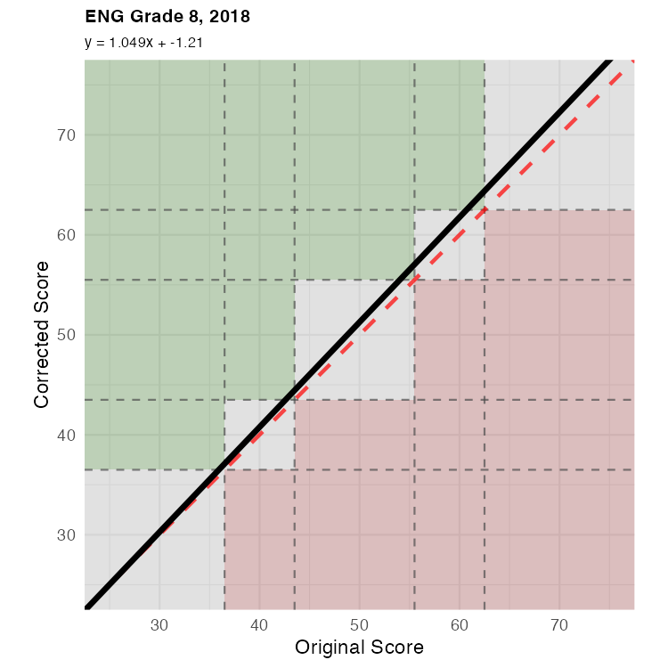

| Original | Level 1 | Level 2 | Level 3 | Level 4 | Level 5 | Total |
|---:|---:|---:|---:|---:|---:|---:|
| Level 1 | 4,552 |   735 |     0 |     0 |     0 | 5,287 |
| Level 2 |     0 | 9,708 | 1,745 |     0 |     0 | 11,453 |
| Level 3 |      0 |      0 | 19,986 |  2,970 |      0 | 22,956 |
| Level 4 |     0 |     0 |     0 | 9,278 | 2,498 | 11,776 |
| Level 5 |     0 |     0 |     0 |     0 | 7,290 | 7,290 |

**Total test-takers:** 58,762
- **Shifted level:** 7,948 (13.53%)
- **Shifted up:** 7,948 (13.53%)
- **Shifted down:** 0 (0%)

### 2019

| Original | Level 1 | Level 2 | Level 3 | Level 4 | Level 5 | Total |
|---:|---:|---:|---:|---:|---:|---:|
| Level 1 | 5,124 |   446 |     0 |     0 |     0 | 5,570 |
| Level 2 |     0 | 9,748 | 1,784 |     0 |     0 | 11,532 |
| Level 3 |      0 |      0 | 20,062 |  3,448 |      0 | 23,510 |
| Level 4 |     0 |     0 |     0 | 8,676 | 3,228 | 11,904 |
| Level 5 |     0 |     0 |     0 |     0 | 7,649 | 7,649 |

**Total test-takers:** 60,165
- **Shifted level:** 8,906 (14.8%)
- **Shifted up:** 8,906 (14.8%)
- **Shifted down:** 0 (0%)

### 2020

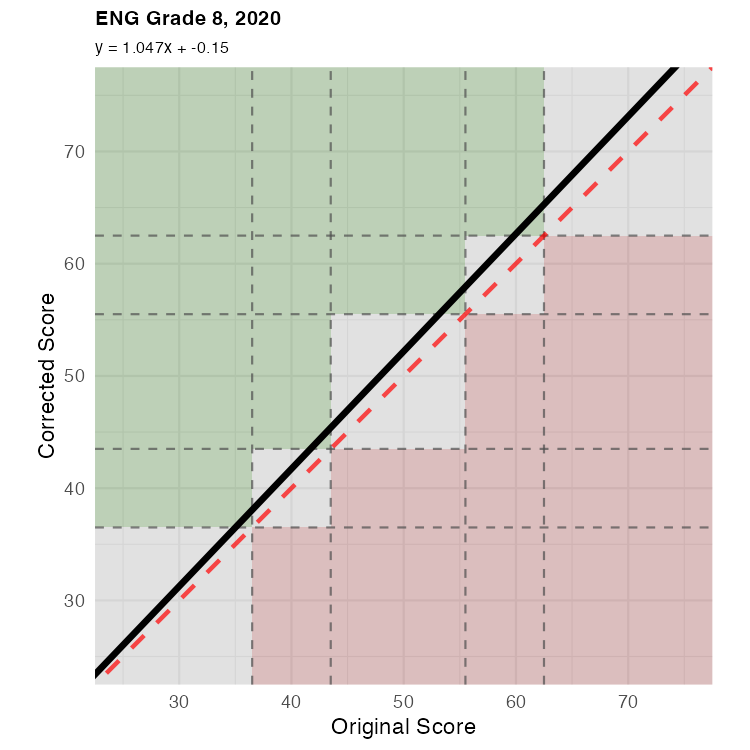

| Original | Level 1 | Level 2 | Level 3 | Level 4 | Level 5 | Total |
|---:|---:|---:|---:|---:|---:|---:|
| Level 1 | 4,188 | 1,694 |     0 |     0 |     0 | 5,882 |
| Level 2 |     0 | 7,426 | 3,277 |     0 |     0 | 10,703 |
| Level 3 |      0 |      0 | 18,502 |  5,124 |      0 | 23,626 |
| Level 4 |     0 |     0 |     0 | 8,556 | 4,168 | 12,724 |
| Level 5 |     0 |     0 |     0 |     0 | 6,952 | 6,952 |

**Total test-takers:** 59,887
- **Shifted level:** 14,263 (23.82%)
- **Shifted up:** 14,263 (23.82%)
- **Shifted down:** 0 (0%)

### 2021

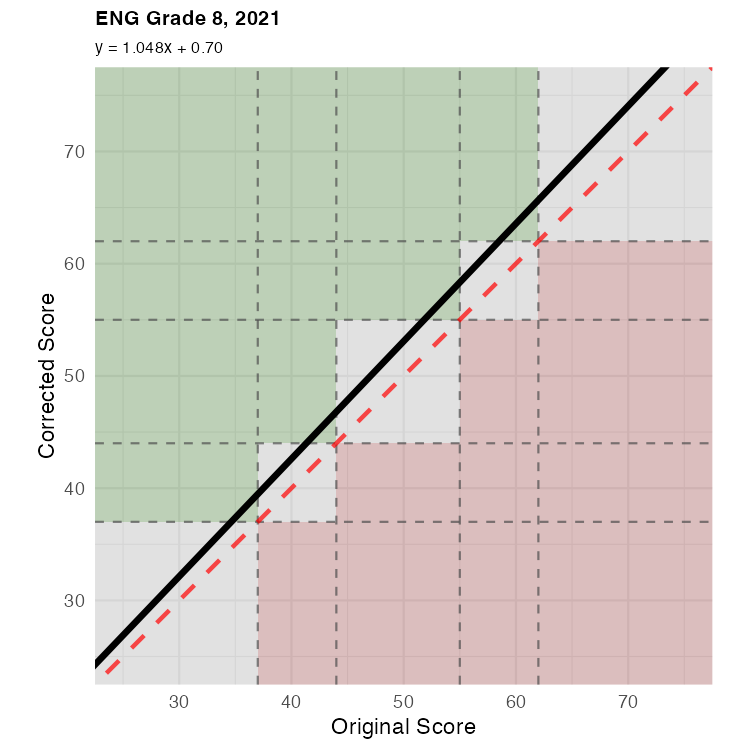

| Original | Level 1 | Level 2 | Level 3 | Level 4 | Level 5 | Total |
|---:|---:|---:|---:|---:|---:|---:|
| Level 1 | 3,099 | 2,366 |     0 |     0 |     0 | 5,465 |
| Level 2 |     0 | 6,262 | 5,033 |     0 |     0 | 11,295 |
| Level 3 |      0 |      0 | 16,813 |  7,332 |      0 | 24,145 |
| Level 4 |     0 |     0 |     0 | 7,227 | 6,114 | 13,341 |
| Level 5 |     0 |     0 |     0 |     0 | 7,284 | 7,284 |

**Total test-takers:** 61,530
- **Shifted level:** 20,845 (33.88%)
- **Shifted up:** 20,845 (33.88%)
- **Shifted down:** 0 (0%)

# Mathematics (Regning)

## Grade 5 (5. trinn)

### Score Ranges with Level Changes

The figure below shows which score ranges resulted in different competence level assignments after correction.
Green segments indicate scores that were upgraded; red segments indicate downgrades.

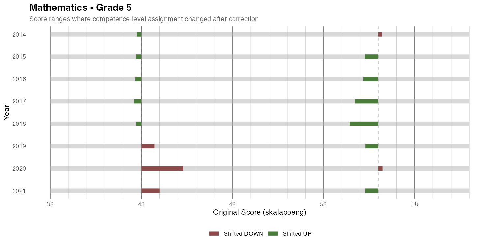

---

### 2014

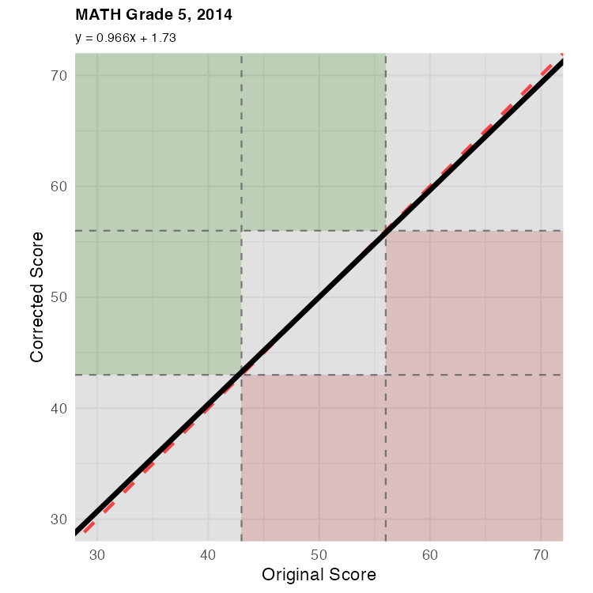

| Original | Level 1 | Level 2 | Level 3 | Total |
|---:|---:|---:|---:|---:|
| Level 1 | 14,559 |    503 |      0 | 15,062 |
| Level 2 |      0 | 26,540 |      0 | 26,540 |
| Level 3 |      0 |    348 | 15,279 | 15,627 |

**Total test-takers:** 57,229
- **Shifted level:** 851 (1.49%)
- **Shifted up:** 503 (0.88%)
- **Shifted down:** 348 (0.61%)

### 2015

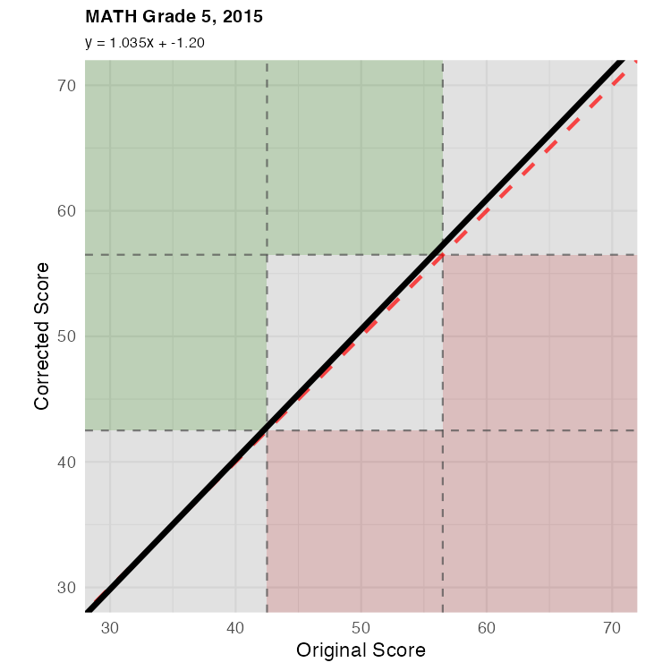

| Original | Level 1 | Level 2 | Level 3 | Total |
|---:|---:|---:|---:|---:|
| Level 1 | 13,968 |    596 |      0 | 14,564 |
| Level 2 |      0 | 25,901 |  1,286 | 27,187 |
| Level 3 |      0 |      0 | 15,374 | 15,374 |

**Total test-takers:** 57,125
- **Shifted level:** 1,882 (3.29%)
- **Shifted up:** 1,882 (3.29%)
- **Shifted down:** 0 (0%)

### 2016

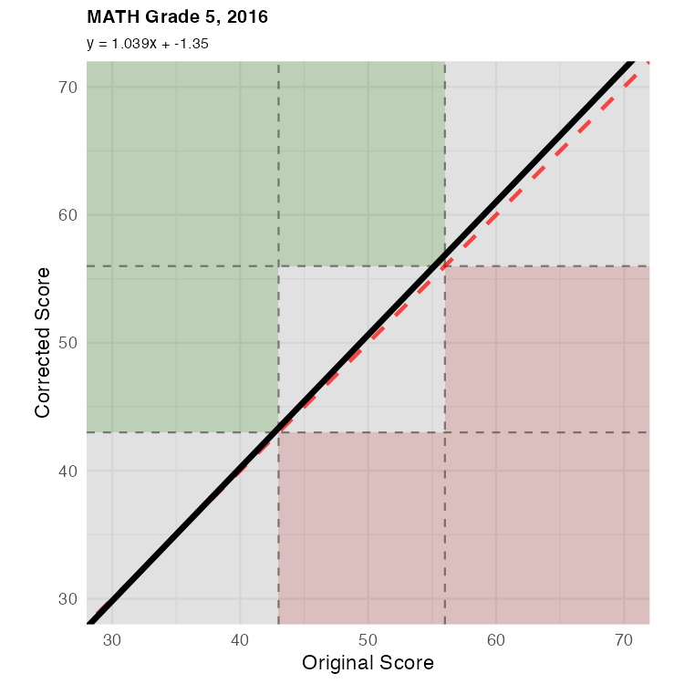

| Original | Level 1 | Level 2 | Level 3 | Total |
|---:|---:|---:|---:|---:|
| Level 1 | 13,934 |    716 |      0 | 14,650 |
| Level 2 |      0 | 26,979 |  1,604 | 28,583 |
| Level 3 |      0 |      0 | 15,607 | 15,607 |

**Total test-takers:** 58,840
- **Shifted level:** 2,320 (3.94%)
- **Shifted up:** 2,320 (3.94%)
- **Shifted down:** 0 (0%)

### 2017

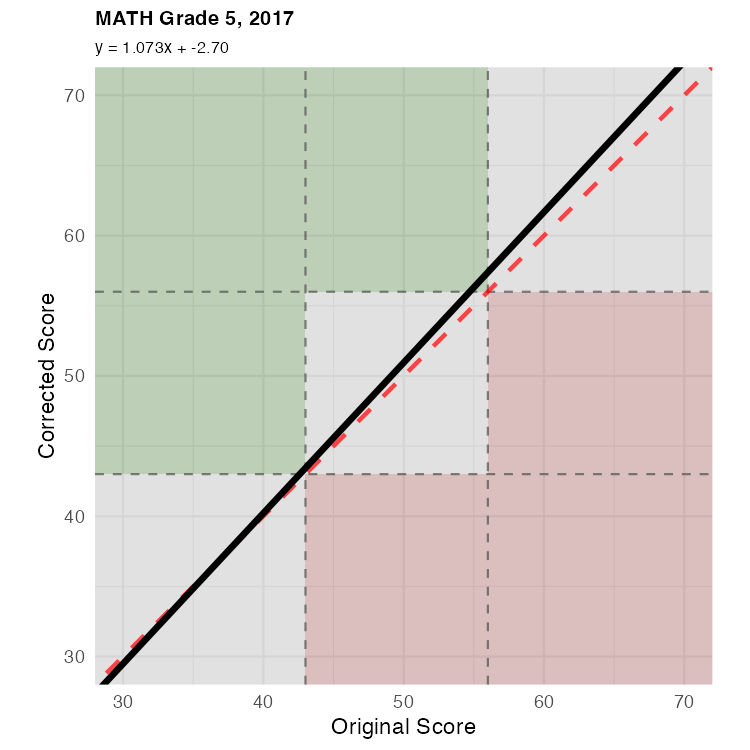

| Original | Level 1 | Level 2 | Level 3 | Total |
|---:|---:|---:|---:|---:|
| Level 1 | 13,690 |    844 |      0 | 14,534 |
| Level 2 |      0 | 25,693 |  2,547 | 28,240 |
| Level 3 |      0 |      0 | 15,926 | 15,926 |

**Total test-takers:** 58,700
- **Shifted level:** 3,391 (5.78%)
- **Shifted up:** 3,391 (5.78%)
- **Shifted down:** 0 (0%)

### 2018

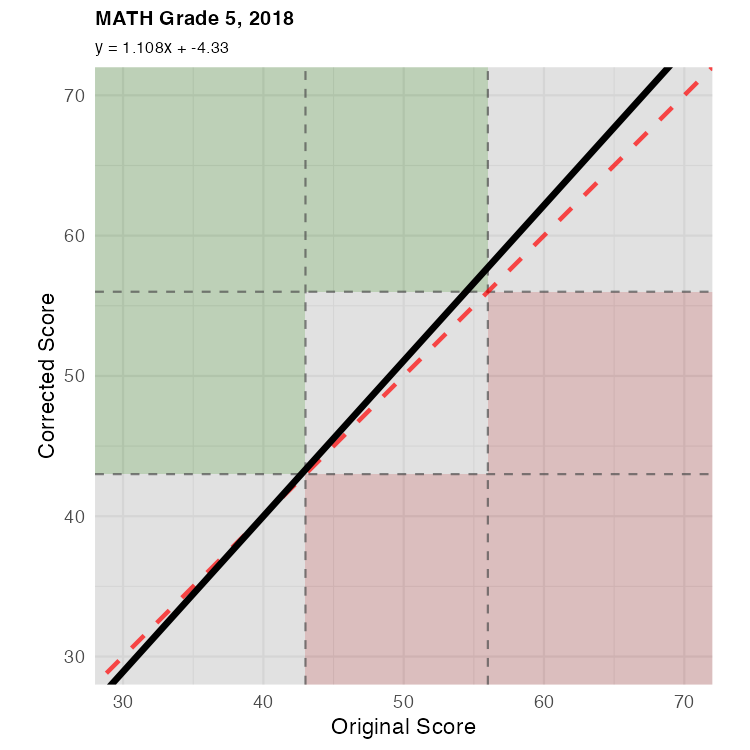

| Original | Level 1 | Level 2 | Level 3 | Total |
|---:|---:|---:|---:|---:|
| Level 1 | 14,356 |    577 |      0 | 14,933 |
| Level 2 |      0 | 25,996 |  3,153 | 29,149 |
| Level 3 |      0 |      0 | 16,398 | 16,398 |

**Total test-takers:** 60,480
- **Shifted level:** 3,730 (6.17%)
- **Shifted up:** 3,730 (6.17%)
- **Shifted down:** 0 (0%)

### 2019

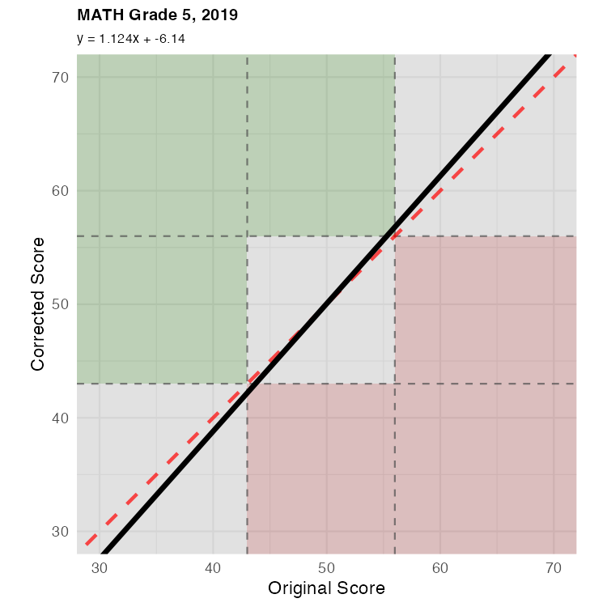

| Original | Level 1 | Level 2 | Level 3 | Total |
|---:|---:|---:|---:|---:|
| Level 1 | 15,619 |      0 |      0 | 15,619 |
| Level 2 |  1,521 | 26,108 |  1,471 | 29,100 |
| Level 3 |      0 |      0 | 16,635 | 16,635 |

**Total test-takers:** 61,354
- **Shifted level:** 2,992 (4.88%)
- **Shifted up:** 1,471 (2.4%)
- **Shifted down:** 1,521 (2.48%)

### 2020

| Original | Level 1 | Level 2 | Level 3 | Total |
|---:|---:|---:|---:|---:|
| Level 1 | 15,539 |      0 |      0 | 15,539 |
| Level 2 |  5,145 | 24,170 |      0 | 29,315 |
| Level 3 |      0 |    458 | 15,138 | 15,596 |

**Total test-takers:** 60,450
- **Shifted level:** 5,603 (9.27%)
- **Shifted up:** 0 (0%)
- **Shifted down:** 5,603 (9.27%)

### 2021

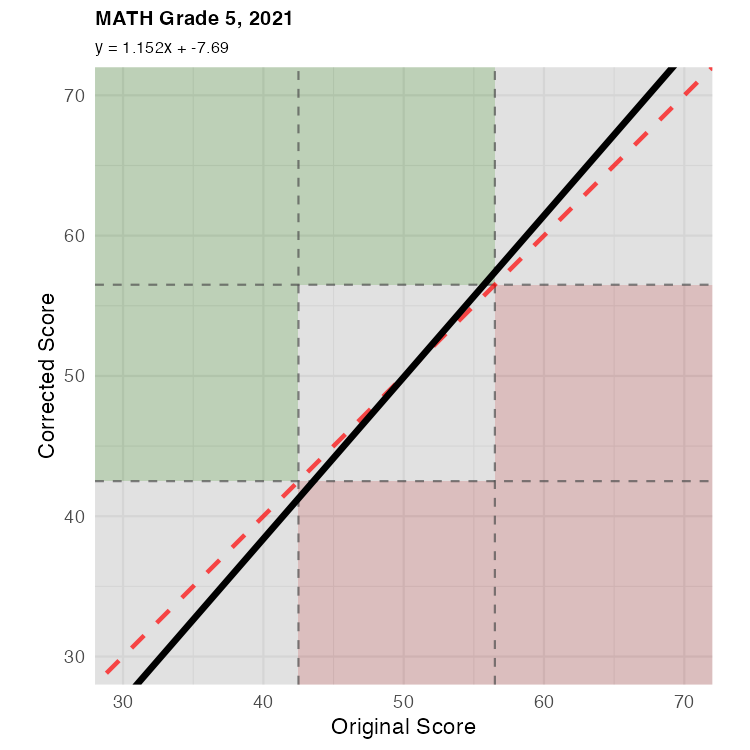

| Original | Level 1 | Level 2 | Level 3 | Total |
|---:|---:|---:|---:|---:|
| Level 1 | 14,580 |      0 |      0 | 14,580 |
| Level 2 |  1,918 | 24,854 |  1,400 | 28,172 |
| Level 3 |      0 |      0 | 15,824 | 15,824 |

**Total test-takers:** 58,576
- **Shifted level:** 3,318 (5.66%)
- **Shifted up:** 1,400 (2.39%)
- **Shifted down:** 1,918 (3.27%)

## Grade 8 (8. trinn)

### Score Ranges with Level Changes

The figure below shows which score ranges resulted in different competence level assignments after correction.
Green segments indicate scores that were upgraded; red segments indicate downgrades.

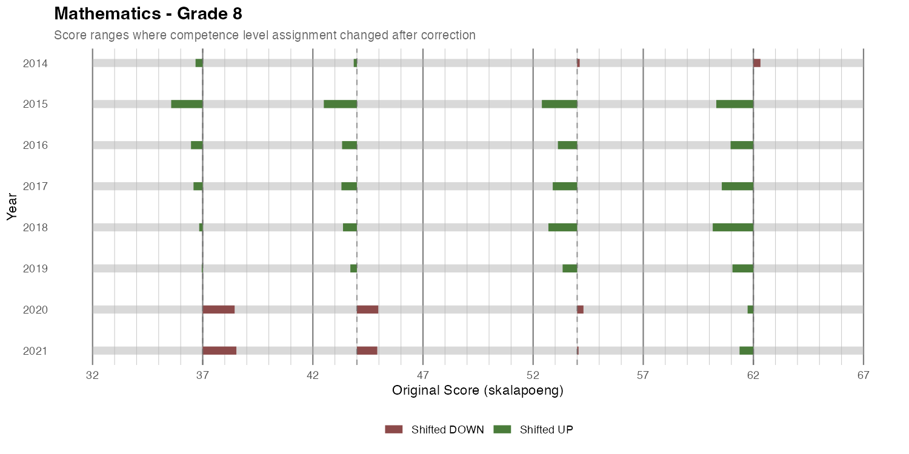

---

### 2014

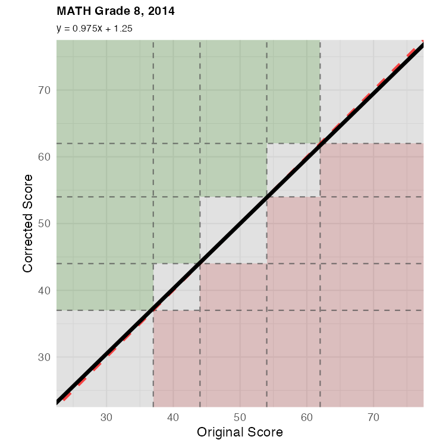

| Original | Level 1 | Level 2 | Level 3 | Level 4 | Level 5 | Total |
|---:|---:|---:|---:|---:|---:|---:|
| Level 1 | 5,511 |   391 |     0 |     0 |     0 | 5,902 |
| Level 2 |      0 | 10,298 |    261 |      0 |      0 | 10,559 |
| Level 3 |      0 |      0 | 21,151 |      0 |      0 | 21,151 |
| Level 4 |      0 |      0 |    217 | 12,742 |      0 | 12,959 |
| Level 5 |     0 |     0 |     0 |   344 | 6,526 | 6,870 |

**Total test-takers:** 57,441
- **Shifted level:** 1,213 (2.11%)
- **Shifted up:** 652 (1.14%)
- **Shifted down:** 561 (0.98%)

### 2015

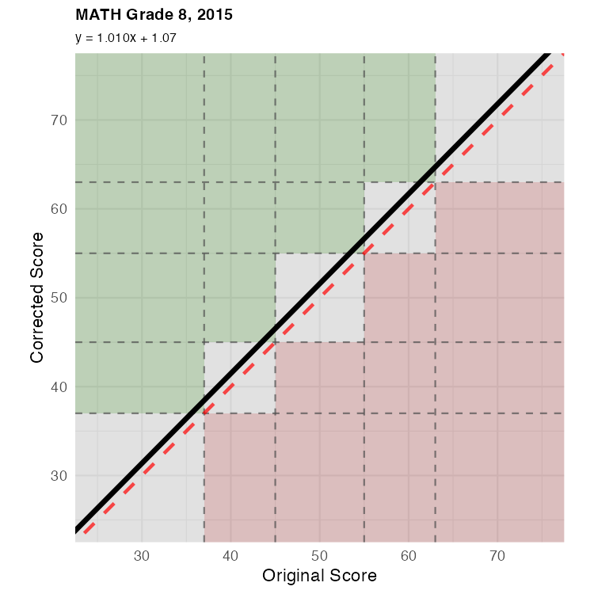

| Original | Level 1 | Level 2 | Level 3 | Level 4 | Level 5 | Total |
|---:|---:|---:|---:|---:|---:|---:|
| Level 1 | 3,526 | 1,336 |     0 |     0 |     0 | 4,862 |
| Level 2 |     0 | 7,866 | 2,868 |     0 |     0 | 10,734 |
| Level 3 |      0 |      0 | 17,967 |  3,246 |      0 | 21,213 |
| Level 4 |      0 |      0 |      0 | 10,616 |  2,108 | 12,724 |
| Level 5 |     0 |     0 |     0 |     0 | 6,761 | 6,761 |

**Total test-takers:** 56,294
- **Shifted level:** 9,558 (16.98%)
- **Shifted up:** 9,558 (16.98%)
- **Shifted down:** 0 (0%)

### 2016

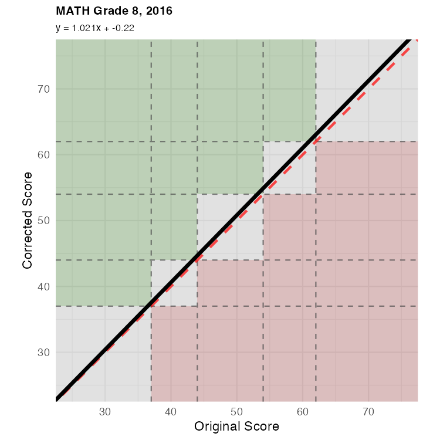

| Original | Level 1 | Level 2 | Level 3 | Level 4 | Level 5 | Total |
|---:|---:|---:|---:|---:|---:|---:|
| Level 1 | 4,244 |   605 |     0 |     0 |     0 | 4,849 |
| Level 2 |     0 | 9,958 | 1,377 |     0 |     0 | 11,335 |
| Level 3 |      0 |      0 | 20,926 |  1,815 |      0 | 22,741 |
| Level 4 |      0 |      0 |      0 | 11,290 |  1,178 | 12,468 |
| Level 5 |     0 |     0 |     0 |     0 | 6,816 | 6,816 |

**Total test-takers:** 58,209
- **Shifted level:** 4,975 (8.55%)
- **Shifted up:** 4,975 (8.55%)
- **Shifted down:** 0 (0%)

### 2017

| Original | Level 1 | Level 2 | Level 3 | Level 4 | Level 5 | Total |
|---:|---:|---:|---:|---:|---:|---:|
| Level 1 | 4,617 |   492 |     0 |     0 |     0 | 5,109 |
| Level 2 |      0 | 10,037 |  1,457 |      0 |      0 | 11,494 |
| Level 3 |      0 |      0 | 19,880 |  2,368 |      0 | 22,248 |
| Level 4 |      0 |      0 |      0 | 11,389 |  1,805 | 13,194 |
| Level 5 |     0 |     0 |     0 |     0 | 6,963 | 6,963 |

**Total test-takers:** 59,008
- **Shifted level:** 6,122 (10.37%)
- **Shifted up:** 6,122 (10.37%)
- **Shifted down:** 0 (0%)

### 2018

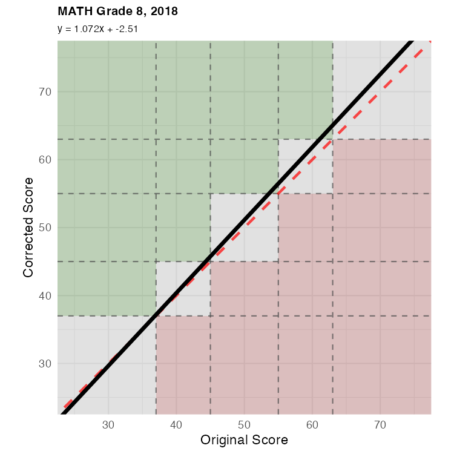

| Original | Level 1 | Level 2 | Level 3 | Level 4 | Level 5 | Total |
|---:|---:|---:|---:|---:|---:|---:|
| Level 1 | 5,469 |   159 |     0 |     0 |     0 | 5,628 |
| Level 2 |     0 | 9,671 | 1,227 |     0 |     0 | 10,898 |
| Level 3 |      0 |      0 | 19,132 |  2,931 |      0 | 22,063 |
| Level 4 |      0 |      0 |      0 | 11,233 |  2,576 | 13,809 |
| Level 5 |     0 |     0 |     0 |     0 | 6,656 | 6,656 |

**Total test-takers:** 59,054
- **Shifted level:** 6,893 (11.67%)
- **Shifted up:** 6,893 (11.67%)
- **Shifted down:** 0 (0%)

### 2019

| Original | Level 1 | Level 2 | Level 3 | Level 4 | Level 5 | Total |
|---:|---:|---:|---:|---:|---:|---:|
| Level 1 | 4,957 |    69 |     0 |     0 |     0 | 5,026 |
| Level 2 |      0 | 11,740 |    629 |      0 |      0 | 12,369 |
| Level 3 |      0 |      0 | 21,958 |  1,426 |      0 | 23,384 |
| Level 4 |      0 |      0 |      0 | 11,998 |  1,064 | 13,062 |
| Level 5 |     0 |     0 |     0 |     0 | 6,728 | 6,728 |

**Total test-takers:** 60,569
- **Shifted level:** 3,188 (5.26%)
- **Shifted up:** 3,188 (5.26%)
- **Shifted down:** 0 (0%)

### 2020

| Original | Level 1 | Level 2 | Level 3 | Level 4 | Level 5 | Total |
|---:|---:|---:|---:|---:|---:|---:|
| Level 1 | 5,191 |     0 |     0 |     0 |     0 | 5,191 |
| Level 2 |  1,950 | 10,429 |      0 |      0 |      0 | 12,379 |
| Level 3 |      0 |  2,192 | 21,088 |      0 |      0 | 23,280 |
| Level 4 |      0 |      0 |    592 | 11,690 |    294 | 12,576 |
| Level 5 |     0 |     0 |     0 |     0 | 6,754 | 6,754 |

**Total test-takers:** 60,180
- **Shifted level:** 5,028 (8.35%)
- **Shifted up:** 294 (0.49%)
- **Shifted down:** 4,734 (7.87%)

### 2021

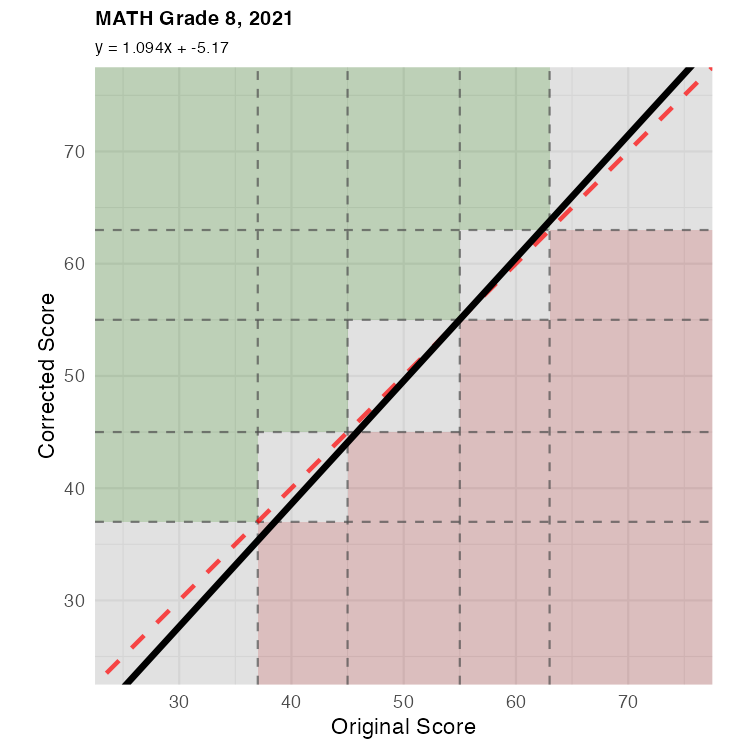

| Original | Level 1 | Level 2 | Level 3 | Level 4 | Level 5 | Total |
|---:|---:|---:|---:|---:|---:|---:|
| Level 1 | 5,675 |     0 |     0 |     0 |     0 | 5,675 |
| Level 2 |  1,928 | 10,074 |      0 |      0 |      0 | 12,002 |
| Level 3 |      0 |  2,080 | 21,629 |      0 |      0 | 23,709 |
| Level 4 |      0 |      0 |    160 | 12,645 |    788 | 13,593 |
| Level 5 |     0 |     0 |     0 |     0 | 6,698 | 6,698 |

**Total test-takers:** 61,677
- **Shifted level:** 4,956 (8.04%)
- **Shifted up:** 788 (1.28%)
- **Shifted down:** 4,168 (6.76%)

# Reading (Lesing)

## Grade 5 (5. trinn)

### Score Ranges with Level Changes

The figure below shows which score ranges resulted in different competence level assignments after correction.
Green segments indicate scores that were upgraded; red segments indicate downgrades.

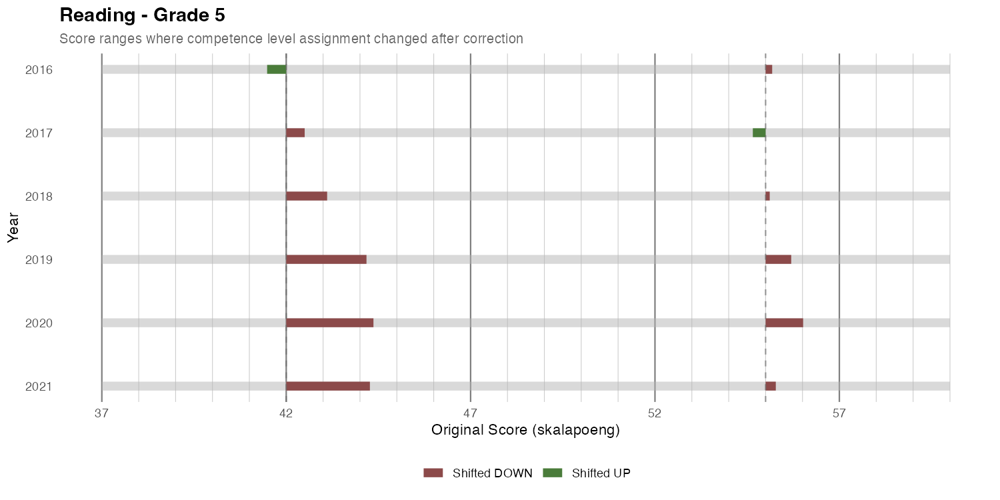

---

### 2016

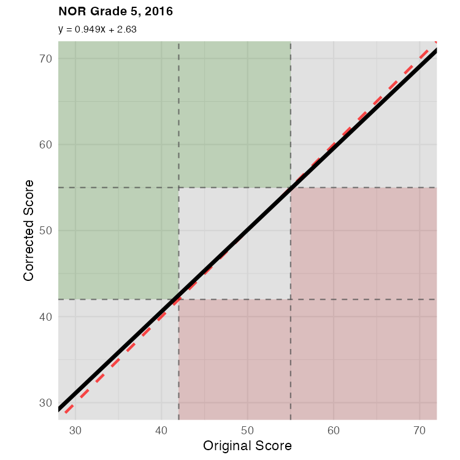

| Original | Level 1 | Level 2 | Level 3 | Total |
|---:|---:|---:|---:|---:|
| Level 1 | 12,770 |  1,011 |      0 | 13,781 |
| Level 2 |      0 | 26,238 |      0 | 26,238 |
| Level 3 |      0 |    333 | 17,957 | 18,290 |

**Total test-takers:** 58,309
- **Shifted level:** 1,344 (2.3%)
- **Shifted up:** 1,011 (1.73%)
- **Shifted down:** 333 (0.57%)

### 2017

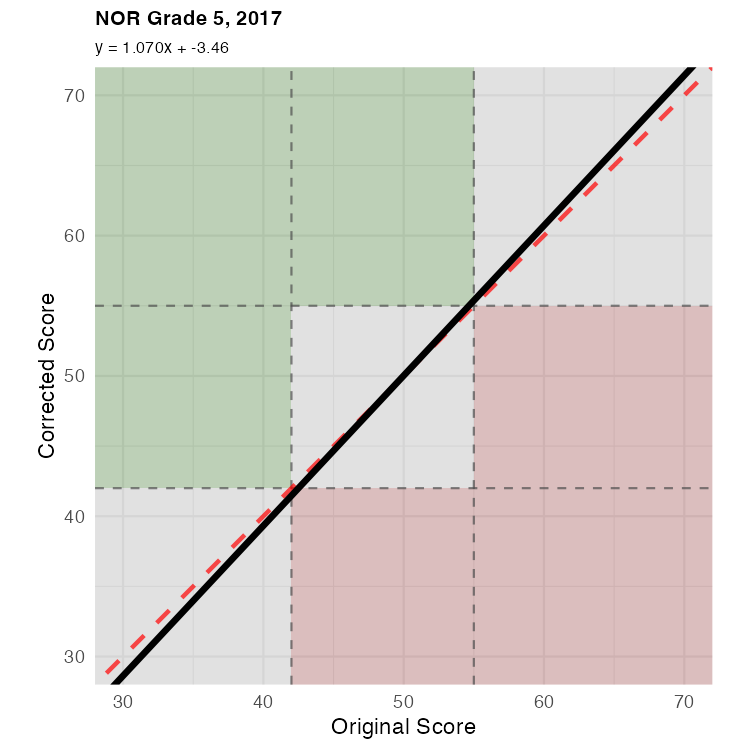

| Original | Level 1 | Level 2 | Level 3 | Total |
|---:|---:|---:|---:|---:|
| Level 1 | 12,773 |      0 |      0 | 12,773 |
| Level 2 |  1,033 | 25,584 |    668 | 27,285 |
| Level 3 |      0 |      0 | 18,120 | 18,120 |

**Total test-takers:** 58,178
- **Shifted level:** 1,701 (2.92%)
- **Shifted up:** 668 (1.15%)
- **Shifted down:** 1,033 (1.78%)

### 2018

| Original | Level 1 | Level 2 | Level 3 | Total |
|---:|---:|---:|---:|---:|
| Level 1 | 12,813 |      0 |      0 | 12,813 |
| Level 2 |  2,356 | 26,549 |      0 | 28,905 |
| Level 3 |      0 |    228 | 17,846 | 18,074 |

**Total test-takers:** 59,792
- **Shifted level:** 2,584 (4.32%)
- **Shifted up:** 0 (0%)
- **Shifted down:** 2,584 (4.32%)

### 2019

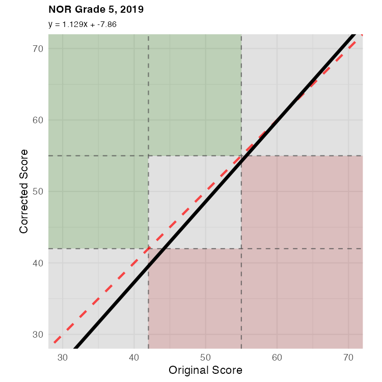

| Original | Level 1 | Level 2 | Level 3 | Total |
|---:|---:|---:|---:|---:|
| Level 1 | 12,813 |      0 |      0 | 12,813 |
| Level 2 |  4,920 | 25,342 |      0 | 30,262 |
| Level 3 |      0 |  1,336 | 16,288 | 17,624 |

**Total test-takers:** 60,699
- **Shifted level:** 6,256 (10.31%)
- **Shifted up:** 0 (0%)
- **Shifted down:** 6,256 (10.31%)

### 2020

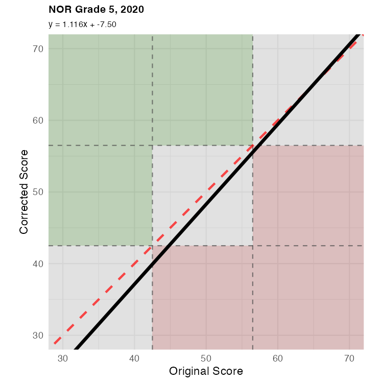

| Original | Level 1 | Level 2 | Level 3 | Total |
|---:|---:|---:|---:|---:|
| Level 1 | 12,820 |      0 |      0 | 12,820 |
| Level 2 |  5,429 | 24,194 |      0 | 29,623 |
| Level 3 |      0 |  1,932 | 15,477 | 17,409 |

**Total test-takers:** 59,852
- **Shifted level:** 7,361 (12.3%)
- **Shifted up:** 0 (0%)
- **Shifted down:** 7,361 (12.3%)

### 2021

| Original | Level 1 | Level 2 | Level 3 | Total |
|---:|---:|---:|---:|---:|
| Level 1 | 12,155 |      0 |      0 | 12,155 |
| Level 2 |  4,983 | 24,146 |      0 | 29,129 |
| Level 3 |      0 |    576 | 16,141 | 16,717 |

**Total test-takers:** 58,001
- **Shifted level:** 5,559 (9.58%)
- **Shifted up:** 0 (0%)
- **Shifted down:** 5,559 (9.58%)

## Grade 8 (8. trinn)

### Score Ranges with Level Changes

The figure below shows which score ranges resulted in different competence level assignments after correction.
Green segments indicate scores that were upgraded; red segments indicate downgrades.

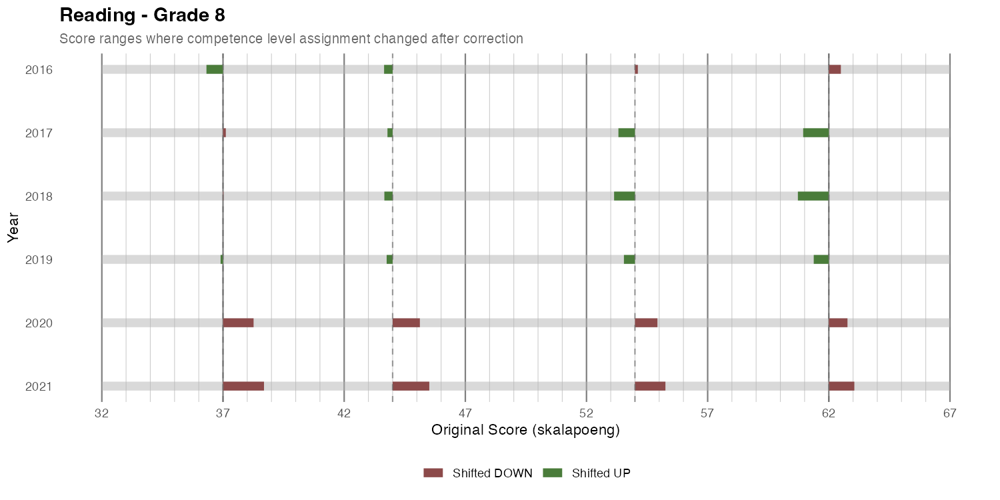

---

### 2016

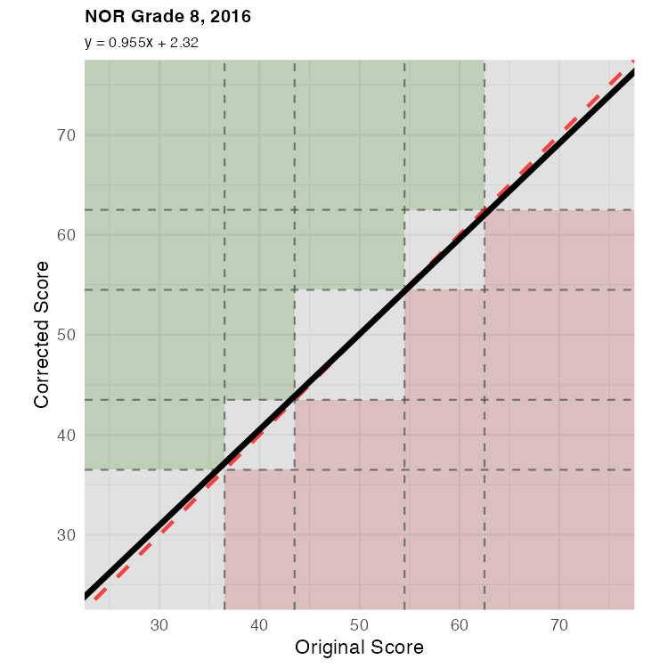

| Original | Level 1 | Level 2 | Level 3 | Level 4 | Level 5 | Total |
|---:|---:|---:|---:|---:|---:|---:|
| Level 1 | 4,285 |   783 |     0 |     0 |     0 | 5,068 |
| Level 2 |      0 | 11,122 |    788 |      0 |      0 | 11,910 |
| Level 3 |      0 |      0 | 22,017 |      0 |      0 | 22,017 |
| Level 4 |      0 |      0 |    238 | 11,455 |      0 | 11,693 |
| Level 5 |     0 |     0 |     0 |   543 | 6,851 | 7,394 |

**Total test-takers:** 58,082
- **Shifted level:** 2,352 (4.05%)
- **Shifted up:** 1,571 (2.7%)
- **Shifted down:** 781 (1.34%)

### 2017

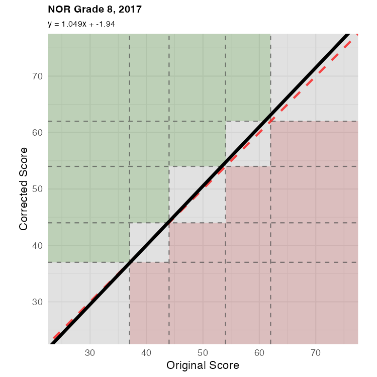

| Original | Level 1 | Level 2 | Level 3 | Level 4 | Level 5 | Total |
|---:|---:|---:|---:|---:|---:|---:|
| Level 1 | 4,494 |     0 |     0 |     0 |     0 | 4,494 |
| Level 2 |    155 | 11,582 |    449 |      0 |      0 | 12,186 |
| Level 3 |      0 |      0 | 21,266 |  1,386 |      0 | 22,652 |
| Level 4 |      0 |      0 |      0 | 11,191 |  1,232 | 12,423 |
| Level 5 |     0 |     0 |     0 |     0 | 7,078 | 7,078 |

**Total test-takers:** 58,833
- **Shifted level:** 3,222 (5.48%)
- **Shifted up:** 3,067 (5.21%)
- **Shifted down:** 155 (0.26%)

### 2018

| Original | Level 1 | Level 2 | Level 3 | Level 4 | Level 5 | Total |
|---:|---:|---:|---:|---:|---:|---:|
| Level 1 | 4,787 |     0 |     0 |     0 |     0 | 4,787 |
| Level 2 |     26 | 10,703 |    708 |      0 |      0 | 11,437 |
| Level 3 |      0 |      0 | 21,191 |  1,822 |      0 | 23,013 |
| Level 4 |      0 |      0 |      0 | 11,504 |  1,514 | 13,018 |
| Level 5 |     0 |     0 |     0 |     0 | 6,697 | 6,697 |

**Total test-takers:** 58,952
- **Shifted level:** 4,070 (6.9%)
- **Shifted up:** 4,044 (6.86%)
- **Shifted down:** 26 (0.04%)

### 2019

| Original | Level 1 | Level 2 | Level 3 | Level 4 | Level 5 | Total |
|---:|---:|---:|---:|---:|---:|---:|
| Level 1 | 5,341 |    77 |     0 |     0 |     0 | 5,418 |
| Level 2 |     0 | 9,782 |   528 |     0 |     0 | 10,310 |
| Level 3 |      0 |      0 | 22,783 |  1,064 |      0 | 23,847 |
| Level 4 |      0 |      0 |      0 | 13,898 |    751 | 14,649 |
| Level 5 |     0 |     0 |     0 |     0 | 6,153 | 6,153 |

**Total test-takers:** 60,377
- **Shifted level:** 2,420 (4.01%)
- **Shifted up:** 2,420 (4.01%)
- **Shifted down:** 0 (0%)

### 2020

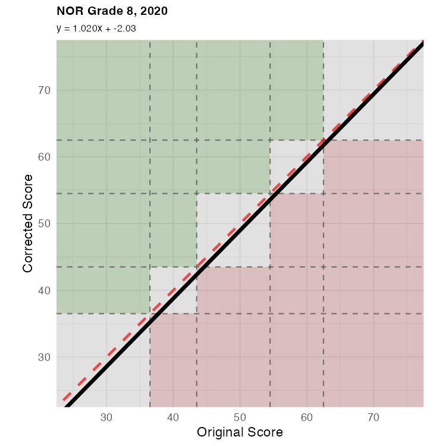

| Original | Level 1 | Level 2 | Level 3 | Level 4 | Level 5 | Total |
|---:|---:|---:|---:|---:|---:|---:|
| Level 1 | 5,084 |     0 |     0 |     0 |     0 | 5,084 |
| Level 2 |  1,601 | 10,394 |      0 |      0 |      0 | 11,995 |
| Level 3 |      0 |  2,416 | 20,495 |      0 |      0 | 22,911 |
| Level 4 |      0 |      0 |  2,048 | 11,834 |      0 | 13,882 |
| Level 5 |     0 |     0 |     0 |   829 | 5,473 | 6,302 |

**Total test-takers:** 60,174
- **Shifted level:** 6,894 (11.46%)
- **Shifted up:** 0 (0%)
- **Shifted down:** 6,894 (11.46%)

### 2021

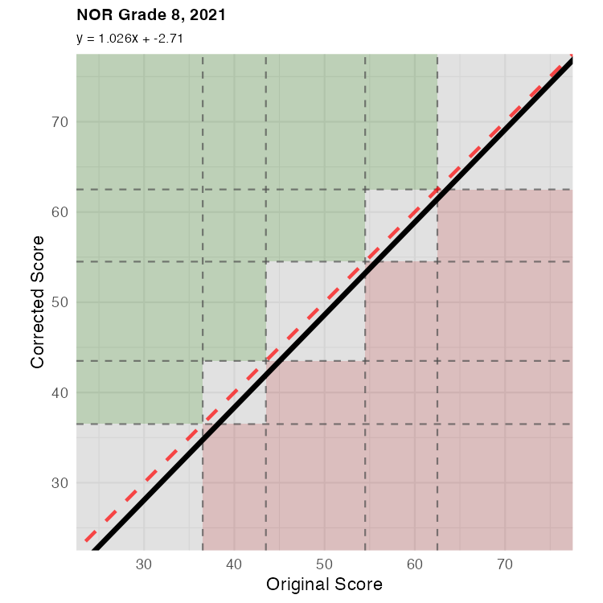

| Original | Level 1 | Level 2 | Level 3 | Level 4 | Level 5 | Total |
|---:|---:|---:|---:|---:|---:|---:|
| Level 1 | 5,362 |     0 |     0 |     0 |     0 | 5,362 |
| Level 2 | 2,362 | 9,847 |     0 |     0 |     0 | 12,209 |
| Level 3 |      0 |  3,396 | 19,940 |      0 |      0 | 23,336 |
| Level 4 |      0 |      0 |  2,666 | 11,305 |      0 | 13,971 |
| Level 5 |     0 |     0 |     0 | 1,165 | 5,485 | 6,650 |

**Total test-takers:** 61,528
- **Shifted level:** 9,589 (15.58%)
- **Shifted up:** 0 (0%)
- **Shifted down:** 9,589 (15.58%)

# Summary

**Total students analyzed:** 2,596,963
- **Total shifted:** 223,276 (8.6%)
- **Shifted up:** 147,313 (5.67%)
- **Shifted down:** 75,963 (2.93%)

